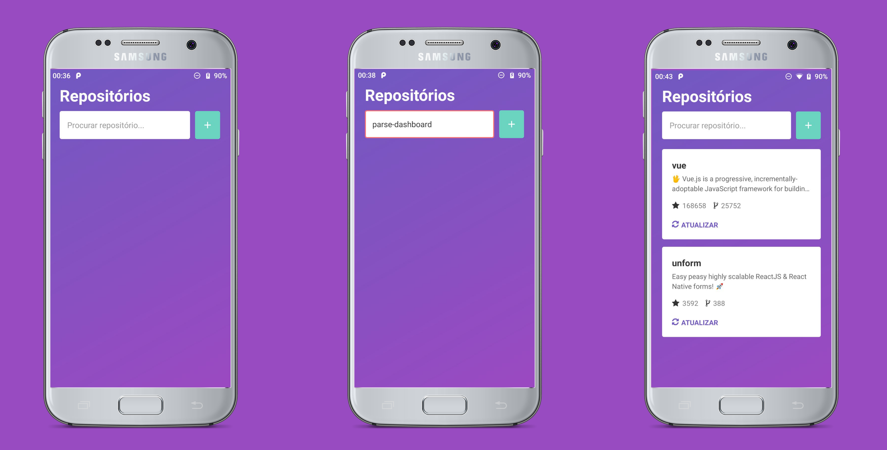

# React Native Realm DB (2019)
<p align="left">
  

  
  
  <a href="https://github.com/Relirk/github-repo-realmdb/commits/master">
    
  </a>

  <a href="https://github.com/Relirk/github-repo-realmdb/issues">
    
  </a>

  
</p>

:iphone: React Native application using the Github and RealmDB API for offline storage]
- Based on the study of the [Rocketseat video](https://www.youtube.com/watch?v=y5Hv7pMA1uo&t=1066s)

###



### Tools used:

- [Rect Native](https://reactnative.dev/)
- [Realm](https://realm.io/)
- [Github API](https://developer.github.com/v3/)
- [Axios](https://github.com/axios/axios)

### Running Locally

```sh
# Install dependencies
yarn install

# Start the metro bundler into a new terminal tab
yarn start

# Start the app android
react-native run-android

# Start the app ios
react-native run-ios --device
```
